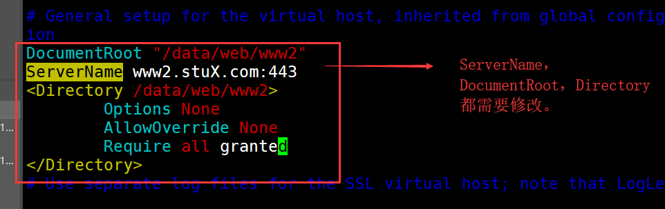
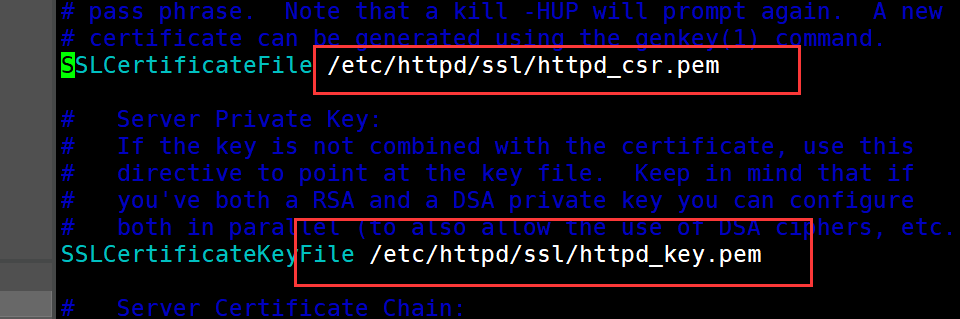
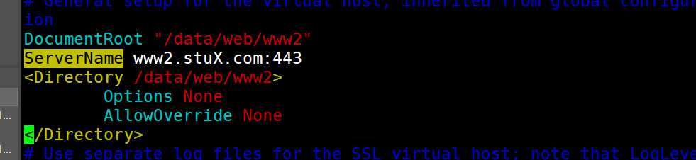

* content
{:toc}


配置httpd时的良好习惯：

```
(1)加入新的配置时，尽量在/etc/httpd/conf.d下，加入新的模块配置文件。若是必须在主配置文件中修改，才修改主配置文件/etc/httpd/conf/httpd.conf
(2)对于旧的配置，不要直接将其修改，而是在其前面加上一个#号注释，然后另起一行加入新的配置信息。（这一点对于配置其他的所有服务也一样）
```


博主配置时，各主机的IP地址以及其对应的身份。

| IP地址        | 身份                      |
| ------------- | ------------------------- |
| 192.168.10.10 | CentOS7的httpd服务端      |
| 192.168.10.30 | httpd客户端及CA证书分发处 |
| 192.168.10.40 | CentOS6的httpd服务端      |


# 1.题目一

建立httpd服务，要求：

```
(1) 提供两个基于名称的虚拟主机：
	www1.stuX.com，页面文件目录为/data/web/www1；错误日志为/data/web/www1/logs/error_log，访问日志为/data/web/www1/logs/access_log；
	www2.stuX.com，页面文件目录为/data/web/www2；错误日志为/data/web/www2/logs/error_log，访问日志为/data/web/www2/logs/access_log；
(2) 通过www1.stuX.com/server-status输出其状态信息，且要求只允许提供账号的用户访问；
(3) www1不允许192.168.1.0/24网络中的主机访问；
```

## 1.1  httpd2.4版本的配置

创建对应的目录及文件：

```
~]# mkdir -pv /data/web/www1/logs
~]# mkdir -pv /data/web/www2/logs
~]# echo -e "<h1>www1</h1>\nI am www1" > /data/web/www1/index.html
~]# echo -e "<h1>www2</h1>\nI am www2" > /data/web/www2/index.html
~]# cd /etc/httpd/conf.d/
conf.d]# htpasswd -c passwd link
```

新建相应的配置文件：

```shell
conf.d]# cat www1.conf 
<VirtualHost 192.168.10.10:80>
	ServerName www1.stuX.com
	DocumentRoot /data/web/www1
	ErrorLog /data/web/www1/logs/error_log
	CustomLog /data/web/www1/logs/access_log combined
	<Directory /data/web/www1>
		Options None
		AllowOverride None
		<RequireAll>
		Require not ip 192.168.1.0/24
		Require all granted
		</RequireAll>
	</Directory>
	<Location /server-status>
		SetHandler server-status
		AuthType Basic
		AuthName "Please input username and password!"
		AuthUserFile "/etc/httpd/conf.d/passwd"
		Require user link
	</Location>
</VirtualHost>

conf.d]# cat www2.conf 
<VirtualHost 192.168.10.10:80>
	ServerName www2.stuX.com
	DocumentRoot /data/web/www2
	ErrorLog /data/web/www2/logs/error_log
	CustomLog /data/web/www2/logs/access_log combined
	<Directory /data/web/www2>
		Options None
		AllowOverride None
		Require all granted
	</Directory>
</VirtualHost>
```

由于没有配置DNS服务，直接在**客户端**修改hosts配置文件

```shell
~] echo "192.168.10.10 www1.stuX.com www2.stuX.com" >> /etc/hosts
```

然后使用浏览器访问www1.stuX.com、www2.stuX.com以及www1.stuX.com/server-status，最后一个网页需要输入密码。

## 1.2 httpd2.2版本的配置

创建对应的目录及文件：

```
~]# mkdir -pv /data/web/www1/logs
~]# mkdir -pv /data/web/www2/logs
~]# echo -e "<h1>www1</h1>\nI am www1" > /data/web/www1/index.html
~]# echo -e "<h1>www2</h1>\nI am www2" > /data/web/www2/index.html
~]# cd /etc/httpd/conf.d/
conf.d]# htpasswd -c passwd link
```

新建相应的配置文件：

```shell
conf.d]# cat www1.conf 
①NameVirtualHost 192.168.10.40:80
<VirtualHost 192.168.10.40:80>
		ServerName www1.stuX.com
        DocumentRoot /data/web/www1
        ErrorLog /data/web/www1/logs/error_log
        CustomLog /data/web/www1/logs/access_log
        <Directory /data/web/www1>
                Options None
                AllowOverride None
②               order deny,allow
                deny from 192.168.1.0/24
        </Directory>
        <Location /server-status>
                setHandler server-status
                AuthType Basic
                AuthName "Please input username and password"
                AuthUserFile "/etc/httpd/conf.d/passwd"
                Require user link
        </Location>
</VirtualHost>


conf.d]# cat www2.conf 
NameVirtualHost 192.168.10.40:80
<VirtualHost 192.168.10.40:80>
        ServerName www2.stuX.com
        DocumentRoot /data/web/www2
        ErrorLog /data/web/www2/logs/error_log
        CustomLog /data/web/www2/logs/access_log combined
        <Directory /data/web/www2>
                Options None
                AllowOverride None
        </Directory>
</VirtualHost>
```

> 上面的配置注释：
>
> ①NameVirtualHost的配置：指的是基于这个IP和端口可以使用FQDN的虚拟主机机制。可以在主配置文件中配置，然后将模块配置文件中的配置删除。
>
> ②order：定义生效次序；写在后面的表示默认法则，例如deny写在后面就代表默认deny；
>
> 若deny写在前面，则表示没被deny的默认都被allow

测试时，记得修改/etc/hosts文件。

# 2.题目二

## 2.1  httpd2.4版本的配置

为上面的第2个虚拟主机提供https服务，使得用户可以通过https安全的访问此web站点；

```
(1) 要求使用证书认证，证书中要求使用国家（CN），州（Beijing），城市（Beijing），组织为(MageEdu)；
(2) 设置部门为DevOps, 主机名为www2.stuX.com；
```

由于一个CA证书及其的贵，本题目又是测试题，我们只需自建一个私有CA即可。

自建CA的步骤如下：

分发CA证书的服务器(192.168.10.30)配置：

```shell
~]# cd /etc/pki/CA
①CA]# (umask 077;openssl genrsa -out private/cakey.pem 2048)
②CA]# openssl req -new -x509 -key private/cakey.pem -out cacert.pem -days 365
You are about to be asked to enter information that will be incorporated
into your certificate request.
What you are about to enter is what is called a Distinguished Name or a DN.
There are quite a few fields but you can leave some blank
For some fields there will be a default value,
If you enter '.', the field will be left blank.
-----
Country Name (2 letter code) [XX]:CN
State or Province Name (full name) []:Beijing
Locality Name (eg, city) [Default City]:Beijing
Organization Name (eg, company) [Default Company Ltd]:RedHat
Organizational Unit Name (eg, section) []:DevOps
Common Name (eg, your name or your server's hostname) []:www.aayylink.com
Email Address []:
CA]# touch index.txt serial 
CA]# echo 01 > serial
```

> 以上指令中的注释：
>
> ①：建立一个新的子终端，然后修改自终端的遮掩码为077,然后使用openssl创建私钥
>
> ②：生成自签证书,-days指定有效时间

请求证书端配置：

```shell
~]# cd /etc/httpd/
httpd]# mkdir ssl
httpd]# cd ssl
ssl]# (umask 077;openssl genrsa -out httpd_key.pem 1024)
①ssl]# openssl req -new -key httpd_key.pem -out httpd_csr.pem
You are about to be asked to enter information that will be incorporated
into your certificate request.
What you are about to enter is what is called a Distinguished Name or a DN.
There are quite a few fields but you can leave some blank
For some fields there will be a default value,
If you enter '.', the field will be left blank.
-----
Country Name (2 letter code) [XX]:CN  
State or Province Name (full name) []:Beijing
Locality Name (eg, city) [Default City]:Beijing
Organization Name (eg, company) [Default Company Ltd]:RedHat
Organizational Unit Name (eg, section) []:DevOps
Common Name (eg, your name or your server's hostname) []:www2.stuX.com
Email Address []:

Please enter the following 'extra' attributes
to be sent with your certificate request
A challenge password []:
An optional company name []:
②ssl]# scp httpd_csr.pem root@192.168.10.30:/tmp/
```

> 以上指令中的注释：
>
> ①：生成CA证书请求，其中国家、省、市、公司、部门都需要和分发证书的服务器一样，CommonName填写的是Web服务端使用SSL的网站的ServerName。

私有CA服务器处理请求

```shell
①CA]# openssl ca -in /tmp/httpd_csr.pem -out certs/httpd_csr.pem
Using configuration from /etc/pki/tls/openssl.cnf
Check that the request matches the signature
Signature ok
Certificate Details:
        Serial Number: 1 (0x1)
        Validity
            Not Before: May 20 12:57:43 2019 GMT
            Not After : May 19 12:57:43 2020 GMT
        Subject:
            countryName               = CN
            stateOrProvinceName       = Beijing
            organizationName          = RedHat
            organizationalUnitName    = DevOps
            commonName                = www2.stuX.com
        X509v3 extensions:
            X509v3 Basic Constraints: 
                CA:FALSE
            Netscape Comment: 
                OpenSSL Generated Certificate
            X509v3 Subject Key Identifier: 
                86:9F:6B:A0:E9:59:72:E7:0E:B2:7A:C1:66:92:87:43:8F:7E:D7:62
            X509v3 Authority Key Identifier: 
                keyid:9E:6A:F3:09:B1:F5:A7:7E:4E:B8:DD:1A:A7:70:94:B9:57:B2:43:29

Certificate is to be certified until May 19 12:57:43 2020 GMT (365 days)
Sign the certificate? [y/n]:y


1 out of 1 certificate requests certified, commit? [y/n]y
Write out database with 1 new entries
Data Base Updated

②CA]# scp certs/httpd_csr.pem 192.168.10.10:/etc/httpd/ssl
```

>以上指令中的注释：
>
>①：授权证书
>
>②：将证书发回给Web服务器

安装web服务端的SSL模块，并对其进行配置，使其使用私有的CA证书。

```shell
conf.d]# yum install mod_ssl -y
conf.d]# vim ssl.conf
```

ssl.conf的配置如下：





重启服务，测试https是否生效

测试https服务是否启动成功：

CA服务器充当客户端访问https网页：

```shell
~]# openssl s_client -connect www2.stuX.com:443 -CAfile /etc/pki/CA/cacert.pem 
```

其中出现:` Verify return code: 0 (ok)`则表示成功。

## 2.2 httpd2.2版本的配置

CA服务器仍是192.168.10.30，不在做重复的配置。

证书的申请和颁发的过程也和上述完全相同。

httpd的配置，只有这个地方和httpd2.4的不同



上图中，不需要配置访问控制，httpd2.2不配置访问控制是默认允许所有的主机访问，httpd2.4不配置访问控制是默认不允许所有的主机访问。

测试的方法也同2.1的一样。